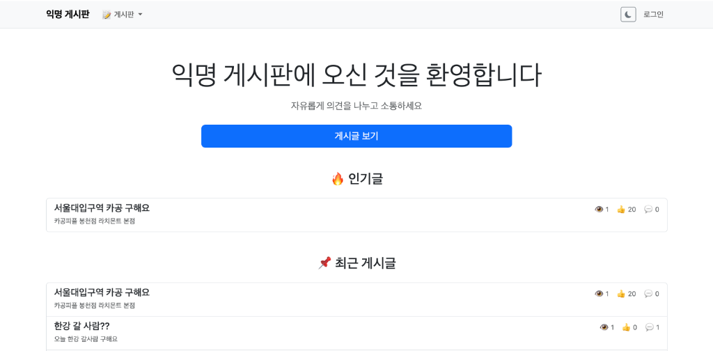
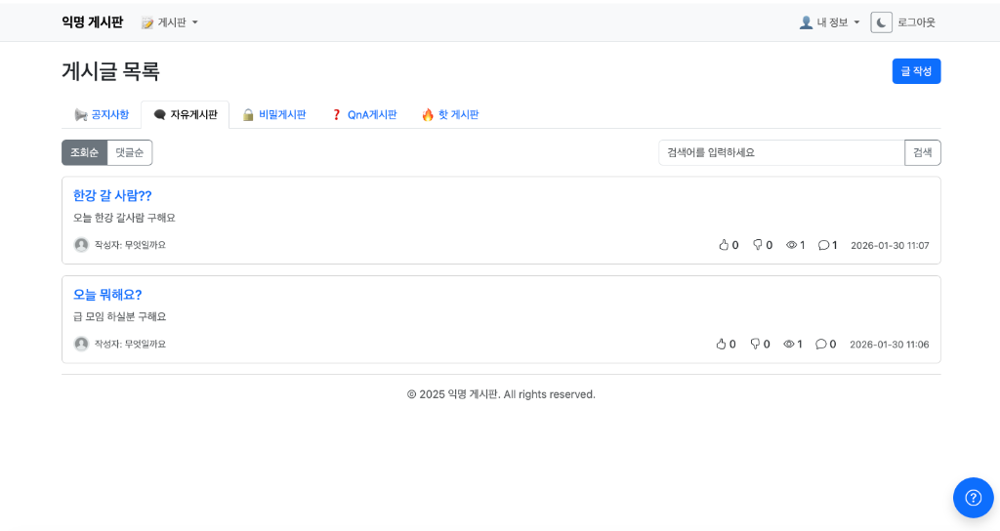
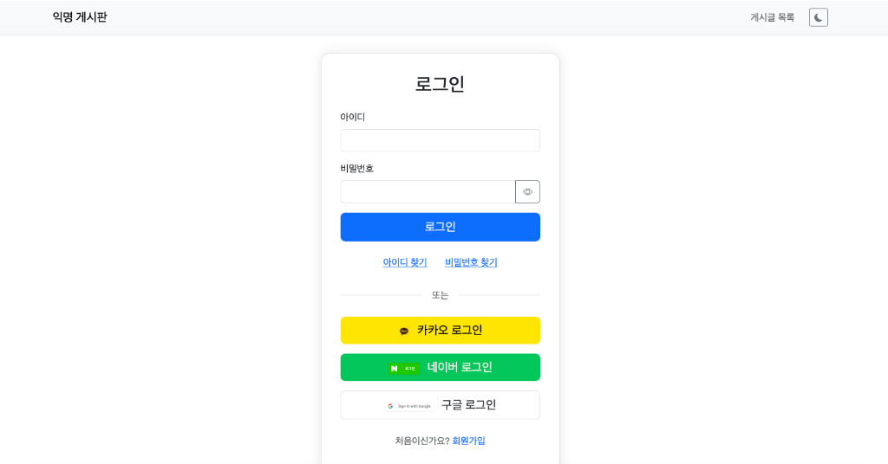
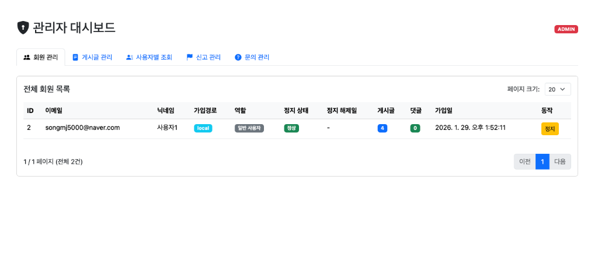

# 익명 게시판 (Anonymous Board)

익명으로 자유롭게 소통하는 커뮤니티 플랫폼 🗨️
  

[프로젝트 GitHub 💻](https://github.com/Minjun1023/anonymous-board)

## 프로젝트 미리보기

- **메인 페이지**

 

- **게시글 목록 페이지**

 

- **로그인 & 회원가입**
<table>
  <tr>
    <td align="center"><b>로그인</b></td>
    <td align="center"><b>회원가입</b></td>
  </tr>
  <tr>
    <td></td>
    <td></td>
  </tr>
</table>

- **관리자 페이지**

  

## 프로젝트 소개

**🗓️ 프로젝트 기간 : 2025.12.15 ~ 2026.01.30**

익명 게시판은 사용자들이 닉네임으로 자유롭게 의견을 나눌 수 있는 익명 커뮤니티 플랫폼입니다.

**주요 특징**
- **완벽한 익명성**: 닉네임 기반 소통으로 개인정보 보호
- **다양한 게시판**: 공지, 자유, 비밀, QnA, 핫 게시판 제공
- **실시간 채팅**: WebSocket 기반 1:1 채팅 기능
- **소셜 로그인**: Google, Kakao, Naver 간편 로그인
- **다크모드**: 사용자 편의를 위한 테마 전환 기능
  

## 프로젝트 기술 스택💻

#### 프로그래밍 언어 및 프레임워크
   

#### 프론트엔드

#### 데이터베이스 및 캐시

#### 빌드 & 배포

  

## 프로젝트 주요 기능⚙️

### 1. 게시판 시스템 
- **다중 게시판 지원**
	- 📢 공지사항: 관리자 전용 공지 게시판
	- 🗨️ 자유게시판: 일반적인 주제로 자유로운 소통
	- 🔒 비밀게시판: 민감한 내용 공유
	- ❓ QnA게시판: 질문과 답변 전용 공간
	- 🔥 핫 게시판: 인기 게시글 자동 집계 (좋아요-싫어요 10이상)

### 2. 게시글 작성 및 상호작용 
- **게시글 CRUD**
	- 게시판별 게시글 작성, 수정, 삭제
	- 게시판 타입 선택 가능
- **상호작용 기능**
	- 좋아요/싫어요 기능
	- 댓글 작성 및 답글
	- 조회수 자동 증가

### 3. 사용자 인증 및 관리 
- **소셜 로그인 (OAuth2)**
	- Google, Kakao, Naver 계정으로 간편 로그인
	- JWT 토큰 기반 인증
- **이메일 인증**
	- 회원가입 시 이메일 인증
	- 비밀번호 찾기 (인증 코드 발송)
- **프로필 관리**
	- 닉네임, 비밀번호 변경
	- 프로필 이미지 업로드
	- 작성한 게시글 및 댓글 조회

### 4. 실시간 기능 
- **1:1 채팅**
	- WebSocket(STOMP) 기반 실시간 채팅
	- 읽음 표시 및 타이핑 인디케이터
	- 채팅방 목록 및 히스토리
- **실시간 알림**
	- 새 댓글, 좋아요 알림
	- 채팅 메시지 알림

### 5. 보안 및 세션 관리 
- **다중 로그인 방지**
	- Redis 기반 세션 관리
	- 중복 로그인 시 기존 세션 자동 종료
- **보안 기능**
	- CSRF 보호
	- XSS 방지
	- BCrypt 비밀번호 암호화

### 6. 기타 편의 기능 
- **다크모드**
	- localStorage 기반 테마 저장
	- 실시간 테마 전환
- **검색 및 필터링**
	- 게시판별 필터링
	- 키워드 검색
	- 조회순/댓글순 정렬
- **문의 시스템**
	- 사용자 문의 제출
	- 관리자 답변 기능

### 7. 관리자 기능 🛠️
- **통합 대시보드**
	- 전체 회원 목록 조회 및 관리
	- 회원 정지 및 정지 해제 기능 (일시/영구 정지)
	- 신고 접수 및 처리 현황 확인
- **컨텐츠 및 시스템 관리**
	- 공지사항 작성 및 수정 (상단 고정 기능)
	- 게시글 및 댓글 강제 삭제/숨김 처리
	- 문의 사항 답변 처리
  

## 프로젝트 후기

### 기술적 성과 
이번 프로젝트를 통해 Spring Boot의 핵심 개념들을 실전에 적용하며 깊이 있게 학습할 수 있었습니다. 특히 **Spring Security와 OAuth2를 활용한 인증/인가**, **JPA를 통한 효율적인 데이터 관리**, **Redis를 활용한 세션 관리 및 캐싱**을 구현하면서 실무에 필요한 기술 스택을 익힐 수 있었습니다.

### 도전과 성장 
**WebSocket을 이용한 실시간 채팅 구현**은 가장 큰 도전이었습니다. STOMP 프로토콜을 처음 다루면서 메시지 브로커의 동작 방식을 이해하고, 읽음 처리와 타이핑 인디케이터 같은 세부 기능까지 완성하면서 실시간 통신에 대한 이해도를 높일 수 있었습니다.

또한 **다중 로그인 방지 및 세션 관리** 기능을 구현하며 보안의 중요성을 체감했습니다. Redis를 활용한 세션 저장소 구성과 중복 로그인 감지 로직을 통해 엔터프라이즈급 애플리케이션의 보안 요구사항을 이해하게 되었습니다.

### UX/UI 개선 경험 
단순한 기능 구현을 넘어 **사용자 경험을 개선하는 과정**이 인상 깊었습니다. 드롭다운 메뉴 충돌 문제를 해결하면서 프론트엔드와 백엔드의 상호작용을 더 깊이 이해하게 되었고, Bootstrap과 커스텀 JavaScript의 조화로운 사용법을 익혔습니다. 다크모드, 반응형 디자인 등을 구현하며 사용자 중심 개발의 가치를 배웠습니다.

### 아쉬운 점과 개선 방향 
- **테스트 코드 부족**: 시간 관계상 충분한 단위 테스트와 통합 테스트를 작성하지 못한 점이 아쉽습니다. 향후 JUnit과 Mockito를 활용한 체계적인 테스트 작성 예정입니다.
- **성능 최적화**: N+1 쿼리 문제나 페이지네이션 최적화 등 성능 개선 여지가 있습니다. QueryDSL 도입 및 인덱싱 전략 수립이 필요합니다.

### 배운 점 및 느낀 점 
프로젝트를 진행하며 **문제 해결 능력**이 크게 향상되었습니다. 단계적으로 원인을 분석하고 디버깅을 통해 문제 해결하였습니다.

또한 **코드의 재사용성과 유지보수성**의 중요성을 깨달았습니다. Thymeleaf fragment를 활용한 레이아웃 통일, DTO 패턴을 통한 계층 분리 등 클린 코드 원칙을 실천하며 확장 가능한 애플리케이션 구조를 만드는 법을 배웠습니다.
